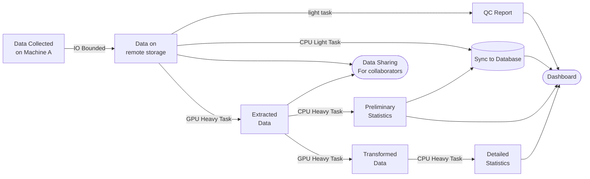

## Modern Problem needs a Modern Solution

Most of my job includes building data pipelines and automating tasks. For every piece of data, there are usually multiple steps to process it, some of them requires the completion of other steps, some of them are bounded by IO, some of them are computational heavy on either CPU or GPU. Some of them are time sensitive, repetitive in nature (suitable for batch processing or parallelization), or requires human in the loop. Here's a simple example of a data pipeline similar to what I have to deal with on a daily basis:

Different tasks have different requirements, and are best optimized differently. GPU Heavy tasks should be running on a high performance cluster/GPU machine. Data transfer should preferably be done directly from collection machine to the remote storage to save bandwidth. Tasks with human supervision should preferably be on a lightweight and responsive machine. And they need to be done in sequence: completing A might allow both B and C to start, but D might only depend on B, E might depend on both C and D, and F might depend on A, B, and C. During my research during undergrad, I only have to deal with a few hundred data (datum?), but now in my adult job I deal with thousands of data every week, and each data might take hours to process. Manually managing and scheduling these tasks is not only tedious, but also error-prone.

## Enter Orchestrators

This is where an orchestrator comes in: An orchestrator helps manage and automate the execution of tasks in a workflow, ensuring that they are executed in the correct order, handling dependencies, retries, and failures, perfect for my use case (Shoutout to ChatGPT for giving me this definition). There are many orchestrators out there, after consulting with a million dollar team (GPT-5 and Gemini 2.5 Pro), I decided to go with [Prefect](https://www.prefect.io/) for a few reasons:

- Prefect is Open Source and allows self-hosting, so I can ensure our unpublished research data is not sent to a third party.
- Unlike most other orchestrators that requires me writing a yaml or define a DAG before anything, Prefect allows me to define my workflow in pure Python, a language I am already familiar with.
- With the usage of workers and workpools, I can easily deploy different tasks to different machines with different capabilities.
- They have a cool RAG slackbot named Marvin, this is awesome for getting to know a huge and complex library like Prefect.
- Native support for Docker, Kubernetes, and Cloud Run, which is great for scaling if we ever encounter tasks where our in-house hardware is not enough.

## Pain

## More Pain, but less painful because of observability

## If I were to do this again

## Would `n8n` be a better fit? 

